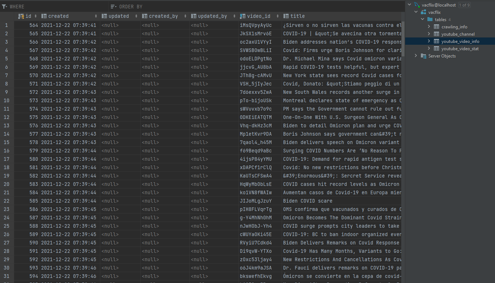
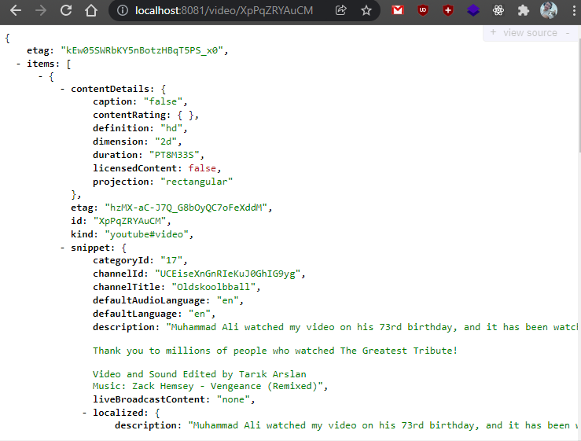

# WORK IN PROGRESS
TL;DR: refactoring EVERYTHING
## dev update
`services/access` contains interactions with the db

`services/crawler` everything that you search AND save to the db (commands)

`services/searcher` proxy to youtube through the api

## VacFlixBackend
Crawl YouTube's channel playlists and playlist videos to store them in our db.  
Then interact with the data through a RESTful API.

## Tech Stack  
- Java 17
- Spring Boot 2.5
- MySQL
- Tools: IntelliJ, Maven

## Architecture
Endpoints are defined in `/api/YouTubeController`. From there a call is made =>
 `/service/YouTubeApiService` which interacts with the defined services and the db.
The folder `/entity` is to define the database and `/repository` is to define how
the objects interact with it (repositories are kind of like interfaces for DAOs).  
  
Spring Boot works through depencendy injection. You define beans with the annotations
 `@service` or `@component` and then you can use them elsewhere with `@Autowired NameOfBean`.

## Instructions
Get YouTube v3 API and save it in resources/application.properties    
youtube.apikey=your_api_key  
add datasource cfg  
spring.datasource.url=jdbc:mysql://localhost:3306/vacflix
spring.datasource.username=root
spring.datasource.password=password  

Execute the db.sql from /sql/db.sql

### endpoints @ api/YouTubeController:
#### crawlers

crawl search results and save them to the db  
crawl/{keyword}/{pageToCrawl}

crawl playlist from a channel id  
crawl/playlist/{id}

crawl video items from a playlist id  
crawl/playlist/items/{id}

crawl a single video id
crawl/video/{id}

#### proxy for JSON returns
get playlist id from our db  
playlist/{id}

get video items from our db  
playlist/items/{id}

get single video for testing purposes
video/{id}

get videos from a search query  
search/{query}

TODO: update, delete, etc

### services/beans @ service/.. 
**YouTubeApiService**: service methods that YouTubeController uses
ApiAuth: connect to the youtube's api  
rest are beans and interfaces for easier modification

### TODOs
- spread service layer into better/more microservices (almost done)
- dockerize
- cleanup
  
### DB example:

### JSON return example:
